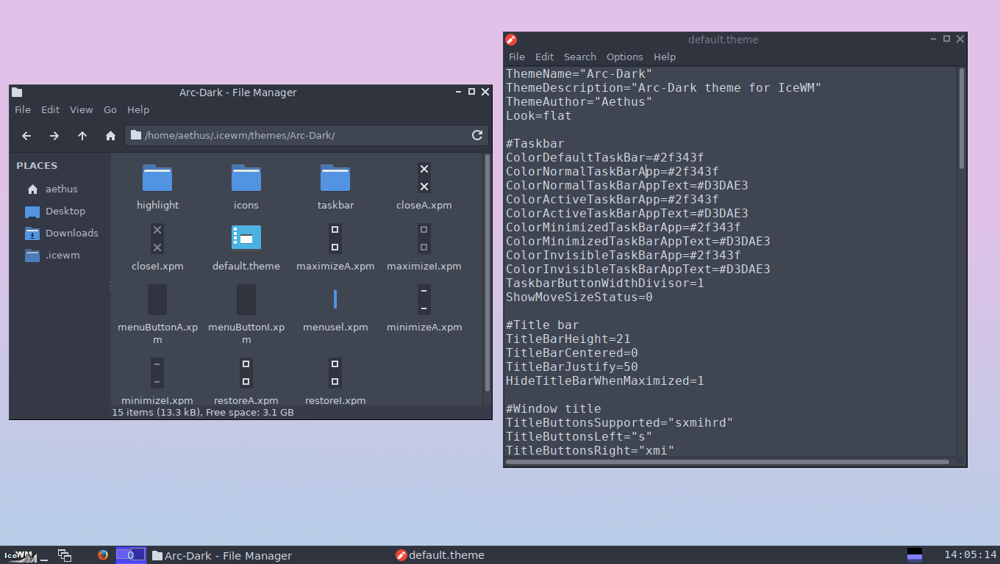

Arc Dark IceWM theme
--------------------
Fork of **Arc-Dark theme for IceWM** to keep it up to date and fix broken stuff.

# Screenshot


# Installation
## Release

Download the latest release from the [releases](https://github.com/Brottweiler/Arc-Dark/releases) page and extract it to `~/.icewm/themes`.

## Clone repo

Run these commands.
```bash
mkdir -p $HOME/.icewm/themes
git clone https://github.com/Brottweiler/Arc-Dark.git $HOME/.icewm/themes
```
The advantage here is you can `git pull` to get new updates.

## Download repo

Press the green **Code** button then **Download ZIP**. Extract it into `~/.icewm/themes`.
